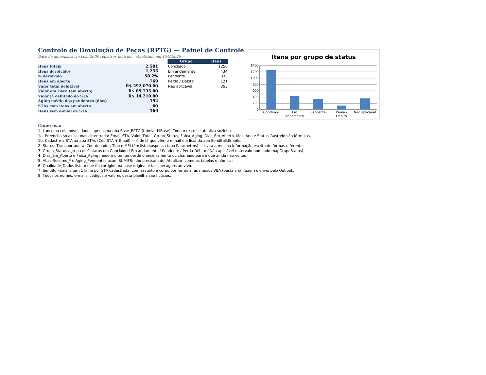

# Controle de Devolução de Peças (RPTG) — Excel + VBA

Painel de controle, tratamento de dados e automação de cobranças para o processo de
devolução de peças em garantia por assistências técnicas (STAs).

> Projeto baseado em um problema real de trabalho. **Todos os dados deste repositório são
> fictícios** (parceiros, e-mails, códigos, chamados, valores e datas foram gerados por
> script). Nenhum dado corporativo foi publicado.

## O problema

Peças trocadas em garantia precisam voltar para análise. O controle era feito em uma
planilha alimentada por exports do sistema de chamados, com ~95 mil linhas e vários
problemas:

- o mesmo status escrito de dezenas de formas diferentes (`OK`, `ok devolvida`, `Ok. Devolvida`...);
- STAs sem e-mail cadastrado, valores em branco, datas inconsistentes;
- cobrança dos parceiros feita manualmente, um e-mail por vez;
- nenhum indicador de quanto estava em aberto, há quanto tempo e quanto valia;
- rastreio das peças em trânsito consultado à mão no site da transportadora.

## A solução

### 1. Base única e padronizada (`Base_RPTG`)
- Tabela estruturada `tblBase`: todas as abas de resumo usam `SUMIFS` sobre ela e se
  atualizam sozinhas ao colar novos dados (sem tabela dinâmica para "Atualizar").
- Listas suspensas (aba `Parametros`) para Status, Transportadora, Coordenador, Tipo e MEI —
  impede que a mesma informação seja escrita de formas diferentes.
- Colunas calculadas: `Email_STA` (busca no cadastro), `Grupo_Status`, `Dias_Em_Aberto`,
  `Faixa_Aging`, `Mes`, `Ano`, `Status_Rastreio`.

### 2. Painel e indicadores (`Dashboard`, `Resumo_*`, `Aging_Pendentes`, `Top_Pecas`)
Itens totais/devolvidos/em aberto, % devolvido, valor debitável, valor em risco, aging médio,
STAs com pendência, itens sem e-mail; quebras por status × mês, transportadora,
regional/coordenador e UF; faixas de aging (0-30, 31-60, 61-90, +90 dias).

### 3. Qualidade dos dados (`Qualidade_Dados`)
Registro do que foi corrigido na base original (de-para de status, e-mails, valores) e
checagens ao vivo: status em branco ou fora da lista, linhas sem STA/e-mail/valor/data,
itens em aberto há mais de 90 dias.

### 4. Automação em VBA (`src/`)

| Módulo | O que faz |
| --- | --- |
| `Em_Andamento.bas` | Monta e envia (Outlook) um e-mail por STA com as peças em aberto, com Cc dos consultores da região; modo "revisar" antes de enviar; log de envio; agendamento por dia/hora. |
| `Cobranca_Trimestral.bas` | Cobrança das peças fora do prazo (3 meses, dia limite 15) e geração da planilha de débito para o Financeiro; agendamento mensal; log em arquivo. |
| `Cobranca_Semanal.bas` | Liga/desliga e configura a cobrança automática semanal. |
| `emails_cobrancas.bas` | Cobrança por STA com regras de prazo por região (Norte tem prazo maior). |
| `email_regiao.bas` | Comunicado mensal por região com anexos em PDF. |
| `Historico_peca.bas` | Importa o export do sistema de chamados, faz o de-para de colunas e atualiza só o que mudou. |
| `Mes_Devido.bas` | Resumo do mês em que cada peça deveria ter sido devolvida. |
| `Rastreio_Sheet.cls` | Consulta o rastreio da transportadora por NF (HTTP + parsing do HTML) e grava status/ocorrência na aba `Rastreio`. |
| `Botoes_Macros.bas` | Cria o painel de botões na aba de e-mails. |
| `EstaPastaDeTrabalho.cls` | `Workbook_Open`: verifica o agendamento ao abrir. |

Tudo que é específico do ambiente (e-mails, pastas, CNPJ, banner de assinatura, horários)
é lido da aba `Parametros`, coluna P — nada fica fixo no código.

## Resultado no processo real
- ~5 mil variações de status reduzidas a 9 status oficiais.
- Cobrança de dezenas de STAs em um clique (antes: um e-mail por vez).
- Visibilidade imediata de valor em risco e aging, por regional e transportadora.
- Planilha de débito para o Financeiro gerada automaticamente.

## Como usar a demonstração

1. Abra `Controle_Devolucao_Pecas_Demo.xlsx` (Excel 2019+ ou 365; abre também no LibreOffice).
   A aba `Dashboard` tem o passo a passo de uso.
2. Para testar as macros: salve como `.xlsm`, abra o editor VBA (`Alt+F11`) e importe os
   arquivos de `src/` (`Arquivo > Importar arquivo`). O conteúdo de `EstaPastaDeTrabalho.cls`
   e `Rastreio_Sheet.cls` deve ser colado nos módulos `EstaPasta_de_trabalho` e da planilha
   `Rastreio`, respectivamente. As macros exigem Outlook para envio.
3. Para gerar uma base nova: `python3 gerar_demo.py 5000` (requer `openpyxl`).

## Limitações da versão pública
- A planilha é entregue em `.xlsx` (sem macros) e o VBA em arquivos separados, para o
  repositório ficar legível e revisável.
- Os e-mails/domínios (`exemplo.com.br`), CNPJ e caminhos de pasta são placeholders.
- O rastreio depende do layout do site da transportadora e pode precisar de ajuste.

## Tecnologias
Excel (tabelas estruturadas, `SUMIFS`, `INDEX/MATCH`, `MAXIFS`, validação de dados, gráficos),
VBA (Outlook, FileSystemObject, MSXML2 HTTP, `Application.OnTime`), Python (`openpyxl`) para
geração dos dados fictícios.
